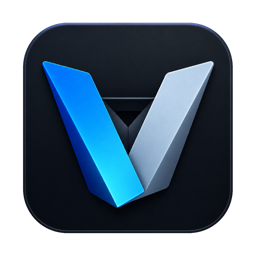

<p align="center">
  
</p>

<h1 align="center">Veo</h1>

<p align="center">
  A native macOS workspace for Codex, built around your local projects and your local CLI.
</p>

Veo turns the locally installed Codex CLI into a focused Mac app. Open any project, move between chats without losing their working directories, follow live reasoning and tool activity, review changes, answer approval requests, and keep a real terminal beside the conversation.

There is no Veo cloud service between the app and Codex. Veo launches `codex app-server` directly and communicates with it over newline-delimited JSON-RPC on standard input and output.

```text
┌──────────────────────────── Veo.app ────────────────────────────┐
│ Projects · chats · composer · review · terminal · preferences  │
└───────────────────────────────┬─────────────────────────────────┘
                                │ local stdio
                                ▼
                    codex app-server (local CLI)
                                │
                 Codex account · models · tools · history
```

Veo has no hosted backend, subscription, relay, phone companion, or bundled credentials. It is an independent open-source project and is not an official OpenAI product.

## What Veo gives you

### One workspace across every project

- Keep chats from all local repositories visible in one sidebar.
- Start a projectless chat immediately in an isolated, app-managed workspace, then optionally mark it temporary before its first turn.
- Group chats by project, rename project labels, pin important threads, and search across the catalog.
- Open a new project at any time; selecting a chat restores its recorded `cwd` automatically.
- Optionally show existing Codex CLI history alongside Veo-owned chats.
- See active work at a glance through progress states, shimmering thread titles, and reconnect-aware Stop controls.

### A native conversation timeline

- Stream responses, reasoning, plans, commands, file changes, tool calls, and structured activity without flattening their order.
- Answer user-input requests, approvals, permission prompts, and MCP forms inside the timeline.
- Inspect grouped activity, review current changes, compact long conversations, fork chats, and manage goals or plans.
- Use the thread minimap to navigate long tasks by topic.
- Show context-window usage as a percentage or token count when you want it.

### A composer that knows the workspace

- Choose the model, reasoning effort, service tier, and access mode reported by the connected Codex runtime.
- Attach files and structured context, mention project files, and queue or steer follow-up messages.
- Type `/` for native commands such as `/model`, `/permissions`, `/review`, `/compact`, `/fork`, `/diff`, `/terminal`, and `/usage`.
- Keep drafts tied to their chats and copy the last response as Markdown.

### A real docked terminal

The terminal is a SwiftTerm-backed interactive PTY, not a command text box. It supports shell editing, multiple tabs, live terminal resizing, and full-screen terminal applications in the current project.

Claude and Codex commands are gated separately from ordinary shell commands. When Agent CLIs are disabled, Veo asks before allowing one to run. Terminal settings can also opt new tabs into the CLIs' full-access bypass flags; those settings are explicit and disabled by default.

### Mac-native appearance and controls

- Follow the system appearance or choose Light or Dark.
- Pick a Veo accent color.
- Choose Solid, Mica, or Liquid Glass treatments for workspace surfaces.
- Use the normal macOS toolbar, menus, keyboard shortcuts, Finder integration, and menu bar extra.
- Respect Reduce Motion for animated status treatments.

### Runtime and account visibility

Veo exposes the capabilities the connected Codex CLI actually reports. Runtime settings surface managed access requirements, experimental features, hooks, thread subscriptions, integrations, and protocol activity without inventing support for unavailable features. Account settings provide local sign-in state, usage, limits, and login controls through Codex.

## Requirements

- macOS 14 or later
- A locally installed and authenticated [Codex CLI](https://github.com/openai/codex)
- Xcode 16 or later when building from source

## Install a release

Download the latest DMG from [GitHub Releases](https://github.com/itsasheruwu/Veo/releases), open it, and drag **Veo** to the **Applications** shortcut. A standard macOS `.pkg` installer is also attached to each release.

Veo is currently distributed with a hardened-runtime ad-hoc signature, not a Developer ID signature or Apple notarization. On first launch, right-click **Veo** in Applications and choose **Open**. If macOS still blocks it, use **System Settings → Privacy & Security → Open Anyway**. Only download installers from this repository.

Confirm that Codex is ready:

```sh
codex --version
codex login status
```

Veo discovers Codex from, in order:

1. An explicit `CODEX_EXECUTABLE` environment variable
2. The GUI process `PATH`
3. Standard Homebrew and common local binary locations

If discovery fails, set `CODEX_EXECUTABLE` to the absolute path of the `codex` binary before opening Veo.

## Build and run

Clone the repository and use the included helper:

```sh
git clone https://github.com/itsasheruwu/Veo.git
cd Veo
./script/build_and_run.sh --verify
```

`--verify` builds Veo, opens the app, and confirms that its process remains running. Other development modes are available:

```sh
./script/build_and_run.sh              # build and open
./script/build_and_run.sh --debug      # build under LLDB
./script/build_and_run.sh --logs       # stream process logs
./script/build_and_run.sh --telemetry  # stream Veo subsystem telemetry
```

To build manually:

```sh
xcodebuild \
  -project Veo.xcodeproj \
  -scheme Veo \
  -configuration Debug \
  -derivedDataPath /tmp/veo-derived \
  build \
  CODE_SIGNING_ALLOWED=NO

open /tmp/veo-derived/Build/Products/Debug/Veo.app
```

The repository contains one shared scheme and one product target: the native macOS app `Veo`.

## First run

1. Open Veo and wait for the local runtime indicator to become ready.
2. Choose **New Chat** for a projectless workspace, or choose **Open Project** and select a folder.
3. Choose an access level. New chats default to **Workspace**.
4. Select a model and any supported reasoning or collaboration options.
5. Send a message. Veo uses the chat's managed scratch directory or selected project as its working directory.

Projectless chats keep their scratch files until permanent deletion. Opening a project remains the explicit route to project-backed work and never filters other repositories out of the sidebar.

## Access levels

| Mode | Filesystem access |
| --- | --- |
| **Read only** | Inspect files and local state without workspace writes |
| **Workspace** | Write inside the selected project and approved temporary locations |
| **Full access** | Operate outside the selected project without filesystem sandboxing |

Full access is always an explicit choice and may also be restricted by managed Codex requirements. Keep important work under version control or backed up, and review approval requests before accepting them.

## Useful shortcuts

| Shortcut | Action |
| --- | --- |
| `⌘N` | New chat |
| `⌘O` | Open project |
| `⇧⌘R` | Refresh chats |
| `⌘.` | Stop the active turn |
| `⌘,` | Open settings |
| `⌃\`` | Show or hide the docked terminal |
| `⌥⌘I` | Show or hide the inspector |
| `Return` | Send a message |
| `Shift-Return` | Insert a newline |

## Local data and network behavior

Veo stores interface preferences—including the selected project, chat, access mode, appearance, terminal options, and model choices—in macOS preferences. Veo-owned chats and timeline items live under Application Support in `com.ash.Veo/Threads`.

Codex credentials and Codex-owned history remain under the control of the locally installed CLI. Veo does not display or retain your authentication secrets.

Veo does not operate an analytics service or a product backend. The Codex subprocess may contact OpenAI or another configured provider, tools may access external services, and interface features such as site icons may retrieve public resources. Those requests follow the feature you use and the permissions granted to the task.

Read the [Privacy Notice](Legal/PRIVACY_POLICY.md) and [Terms of Use](Legal/TERMS_OF_USE.md) for details.

## Architecture

```text
Veo.xcodeproj/             Xcode project and shared Veo scheme
BuildSupport/              Bundle metadata
Veo/
  App/                     SwiftUI app entry point and scenes
  Models/                  Protocol, preference, and navigation models
  Services/                App-server transport, PTY, Git, and utility services
  Stores/                  Thread, runtime, timeline, and interaction coordination
  Views/                   Workspace, composer, terminal, review, and settings UI
script/build_and_run.sh     Build, launch, logging, and verification helper
Legal/                     Privacy notice and terms
```

The app owns one local Codex runtime per process. JSON-RPC responses are correlated by request ID, app-server stdout remains protocol-only, and diagnostics stay on stderr. Veo keeps thread and project identity separate so switching chats can switch local context without hiding the rest of the workspace.

## Contributing

Read [CONTRIBUTING.md](CONTRIBUTING.md) before proposing a change. Keep Veo Mac-native, local-first, and centered on the direct local Codex transport. Do not add hosted relays, mobile companions, subscription gates, or compatibility layers for an earlier architecture.

## License

Veo is available under the [Apache License 2.0](LICENSE).
